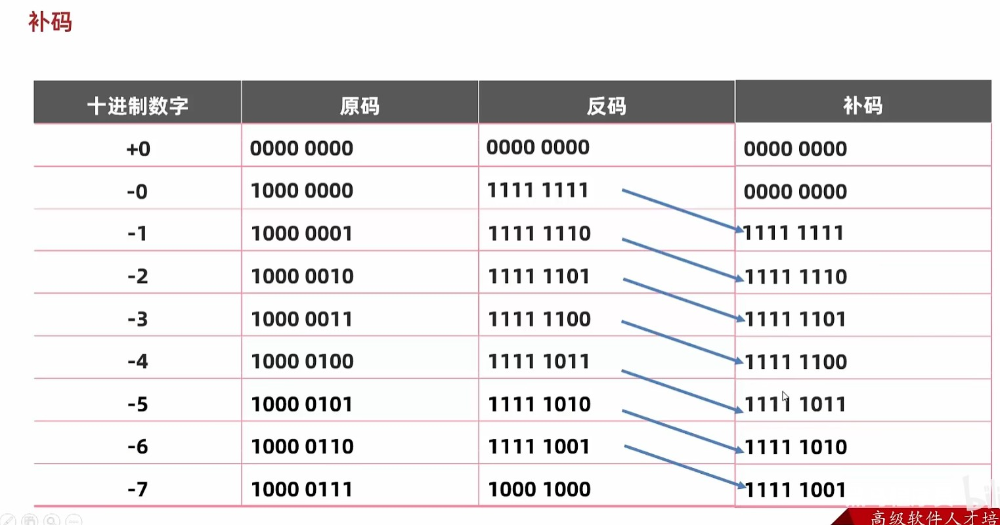
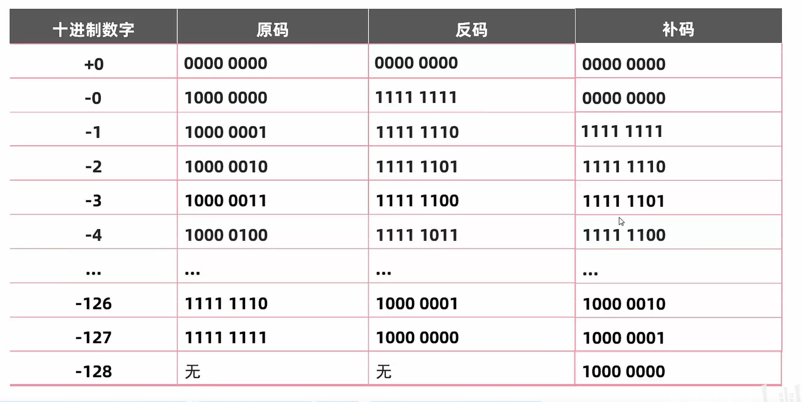

javaSE是桌面应用开发，其他两个版本的基础。CandC++比Java更有桌面开发的优势。javaSE是javaEE基础。

javaME 移动设备主要使用

javaEE web  浏览器+服务器就是java的战场。java,go可以承载巨大的访问量。

编译型语言 整体翻译。Java,c都会产生一个整体翻译后的新文件。
解释型语言 一行一行翻译。Python不会产生新文件

Java的跨平台实际上是通过虚拟机完成的。这个虚拟机是Java为我们提供了现成的。

JDK：开发代码需要的东西：JVM（虚拟机）核心类库，比如System，Java帮我们写好的库。开发工具。
javac 编译工具
java 运行工具
jdb 调试工具
jhat 内存分析工具

JRE:JVM+核心类库+运行工具

JDK包含JRE。JRE包含JVM


Project: MISUMI EC Site https://jp.misumi-ec.com/
从几十年前的 php 版本切换到 Next/React 版，追加各种新功能，各国/移动端对应等等
基本上分为商品选定导线（主要是 ssr 页面展示商品信息）和注文导线（主要 csr 页面，登録/見積/注文/カートなど）

Tech Stack: Next.js/Vercel/Typescript (React/Redux/styled-components/css-modules/React Hook Form)


面试问题

1. 自己紹介
2. 根据项目经验提问（我被问到的和这个项目相关的有 i18n 和性能优化）
3. React/Vue/Nextの評判
4. Github package経験
5. リクエストライブラリが何を使ってます
6. 注目してる技術
7. Agile/Scrum経験（経験あればSprint周期どれくらい）
8. Redux経験、理解
9. CSS Module と styled-component
10. （英語で説明）Next.js’s Server Side vs. Client Side Component
11. よく使ってるReact Hooks、useMemo/useEffect区別
12. よいソースコートはなんですか
13. 品質の良いシステムはなんですか

class就相当于人的细胞。
关键字都是小写。

1. 整数 
2. 小数
3. 字符串 "abc","",
4. 字符 'a','我','0'
5. 布尔值
6. 空 null,null是不能被直接打印的，我们如果想要打印null必须要以"null"形式，这个其实还是字符串

```java
public class HelloWorld{
    public static void main(String[] args){
        System.out.println("abc"+'\t')//"\t"也可以，会把整个字符串补充到8的倍数。abc是3，那么此时\t是5.我们可以利用制表符，来对其我们的打印s。可以让我们的字符串类似表格一样对齐，所以叫制表符。制表符只和他前面的字符串有关系。
    }
}
```

int 整数
double 小数
int n=5;//不同于TS，没有const let var这种。
int a=1,b=2,c=3;

0 0B 0X 分别是8进制 2进制 16进制开头

基本数据类型

1. 整数 byte short int long 
   byte -128-127  short5位  int10位数 long19位
2. 浮点数 （小数 float double
3. 布尔值 boolean
4. 字符 单引号那玩意 char
复杂数据类型

```java
byte b=50;
```

javac编译java后缀文件。 然后java运行class

java HelloWorld  必须要这样才能cmd运行

```
.\HelloWorld.java:3: 错误: 整数太大
        long b=9999999999;
               ^
1 个错误

解决方案
在数字最后面加上L或者l，推荐L。因为l和1非常像。
long b=9999999999L;


这两个代码在Java中的区别在于数值的类型声明。

long b = 9999999999;: 这行代码会导致编译错误，因为9999999999是一个超出int类型范围的整数字面量。默认情况下，整数字面量被解释为int类型。因此，此行代码会引发编译器错误，因为无法将int类型的值赋给long类型的变量b。要解决这个问题，可以在整数字面量后面添加"L"或"l"后缀，将其显式声明为long类型。

long b = 9999999999L;: 这行代码是正确的。通过在整数字面量后添加"L"或"l"后缀，将其显式声明为long类型。这样，编译器就知道将整数字面量解释为long类型，并将其赋值给变量b。

需要注意的是，在Java中，long类型的整数字面量默认是int类型，如果超出int范围，需要显式声明为long类型，以免编译错误。
```


float同理，数字后面加上F或者f

double就不需要加上后缀了。

#### 取值范围

double>float>long>int>short>byte

Scanner可以监测键盘事件


project,module,package,class。项目的层级


整数计算只能得到整数，比如10/3=3。我们只能10.0/3得到小数。


JAVA中数据类型不一样时候进行运算，需要转换成一样的类型才能够进行后续的运算。

int a=10;

double b=20.0;

c=a+b;

隐式转换（自动类型提升）：把取值范围小变成取值范围大

强制转换：反过来

int a=10;

double b=a; 这里就是隐式转换。a自动变成10.0，注意哦，是a被提升了！


byte short char进行运算时候，会先被提升成为int，然后再运算。这是一个小坑点

byte a=10;

byte b=15;

c=a+b; aとbは同時にint型に変換されました。c是int类型


在这两个句子中，区别在于使用的助词。

1. "aとbは同時にint型に変換されました。"
   这句话使用的是助词"に"，表示被转换的目标是"int型"。
2. "aとbは同時にint型と変換されました。"
   这句话使用的是助词"と"，表示a和b同时被转换，并且转换的结果是"int型"。

两个句子的基本含义是相同的，都是表达a和b同时被转换成了int类型。但是，第二个句子使用了"と"助词来表示转换的同时性质，强调了a和b同时进行转换的动作。


"同時に"和"一緒に"是两个表示"同时"的日语表达方式，它们的区别如下：

1. 同時に (どうじに)
   "同時に"强调的是动作或事件在同一时间内同时发生。它用于描述两个或多个动作在相同的时间点上同时发生。这个词通常用于强调时间的一致性和同时性。
2. 一緒に (いっしょに)
   "一緒に"强调的是两个或多个人或物在同一时间、地点或情况下共同存在或共同进行某个动作。它用于描述人们或物体彼此之间的共同性和联合行动。

总而言之，"同時に"侧重于强调时间上的同时性，而"一緒に"则侧重于强调共同性和联合行动。在具体使用时，选择哪个词取决于你想要强调的方面和上下文。


複数のデータが同時にされた場合は、これたちはまずに


#### 字符的+运算

一个字母，单引号就是字符。

1+'a';//值就是98因为小写a是97，注意这里是单引号！

'a'+"a";这里就是aa，因为这里的+是字符串拼接。


#### 自增自减运算符

c++ 我们记住一个口诀c++他比较急，先急着去用，然后再自增。所以说c++的人都比较慌慌张张。

++c就是我，不慌不忙，先自增，再运算。


#### +=

这里和ts有很大的不同点

short a=1;

a+=2;//不仅仅只是a=a+2; 而是这个玩意！a=(short)(a+2)

这里会有一个强制转换，因为a类型是short，那么+=最后就会强制转换成short。这里如果2是一个变量的话，一样的，还是强制转换成short。其他的加减乘除%都同理。

#### 逻辑运算符

&|!这个都是TS具有的。^这个是单独的，相同为false,不相同为true.

idea中，ctrl+d是向下copy一行


#### 原码，反码

01111111表示127

11111111表示-127，第一位表示的是正数或者负数，并且称为 符号位。反码はどのような過程で変わられていますか？符号位が変わっていませんが、その他の全部の数字が反転させています

-56原码：10111000

-56反码：11000111

使用-4原码去+1最终会得到-5的原码

使用-4的反码+1最终会得到-3的反码。

总结：反码用于负数的计算

-0反码是11111111

+0反码是00000000（正数の反码は自分こそです）问题出现了！-0+1会得到+0！！！

问题总结：一旦计算结果跨零了！就会出bug。比如 -5+6结果是0，这不就出bug了。bug就是0被当成了-0和+0被计算了两次！！！



也就是说-1的补码使用的就是-0的反码。

-7的补码使用的就是-6的反码。

-0的补码就是+0的原码。 

正数的原码反码补码都是一样的。



byte  short int long分别占用字节1,2,4,8个字节。


数字计算中没有&&，只有&，|也是。


移出去的数字就不要了。

左移一次就是乘以2.

右移有点点不同。右移后，如果这个数本来是正数，高位补0，如果是负数，高位补1.移出去的同样不要了。补位需要注意，只补第一个多出来的那位数字，其他多出来的都是0.也就是正负数要保持一致，其他的都是补0.

无符号右移：>>>

向右移动，高位全部补0，也就是说他不同于普通右移，他不区分正负数。

#### switch

表达式里面匹配的值：byte,short,int,char。

JDK5之后可以枚举。JDK7以后可以String

case后面的值必须是字面量，不可以是变量！case后面的值不可以重复。

不同于if else，switch的default很像else，但是default可以放在上面也可以写在代码最后面，一般写在最后面，这样便于代码阅读。

swtich里面的case里面必须要写break,不然会有switch穿透，代码不停，还会继续往下执行（也叫case穿透）。Switch逻辑就是遇到break或者大括号才会停止。default我们可以理解成特殊的case。

#### switch新特性

jdk12才有的。

```java
        int num=50;
        switch (num){
            case 10 ->{
                System.out.println("匹配10");
            }case 20 ->{
                System.out.println("匹配20");
            }case 50 ->{
                System.out.println("匹配50");
            }default -> {
                System.out.println("输入有误");
            }
        }
这种写法不会case穿透，并且如果{}只有一句代码，那么{}可以被省略。
```


```java
package com.whc;

import java.util.Scanner;

public class compareoperator {
    public  static  void  main(String[] args){
        int num=50;
        switch (num){
            case 10 ->{
                System.out.println("匹配10");
            }case 20 ->{
                System.out.println("匹配20");
            }case 50 ->{
                System.out.println("匹配50");
            }default -> {
                System.out.println("输入有误");
            }
        }
        Scanner sc=new Scanner(System.in);
        System.out.println(true^false^false);
        System.out.println("输入你的值");
        int myFashion=sc.nextInt();
        System.out.println("输入对象的值");
        int herFashion=sc.nextInt();
        if(myFashion>herFashion){
            System.out.println("还是我的好");
        }else{
            System.out.println("还是她牛");
        }
    }
}

```

Switch简化写法

```java
        Scanner sc=new Scanner(System.in);
        System.out.println("输入你的值");
        int myFashion=sc.nextInt();
        switch (myFashion){
            case 1,2,3,4,5->System.out.println("工作日");
            case 6,7->System.out.println("休息日");
            default->System.out.println("没有选项");
        }
    }
```

#### while

```java
初始化语句（int i=0;）
    while(条件判断语句){
        循环体语句
        条件控制语句
    }
```

例えば

```java
        int i = 0;
        while (i < 10) {
            System.out.println(i);
            i++;
        }
```

for循环我们可以写成while的形式

```java
int i=0;
for(;i<5;i++){
    
}
```

如果我们只知道循环结束的条件的时候，我们必须要用while。

获取相反数

```java
        System.out.println("输入数字值");
        Scanner sc = new Scanner(System.in);
        int num = sc.nextInt();
        int i = 0;
        while (num != 0) {
            int ge = num % 10;
            num = num / 10;
            i = i * 10 + ge;
        }
        System.out.println(i);
```

#### 随机数

需要导包,idea编辑器只要我们写出 new Random();这样的代码，他就会自动帮我们补全：import java.util.Random;

```java
        Random r = new Random();
        int random = r.nextInt(100);//生成0~99的随机数。
        System.out.println(random);
小秘诀
int random = r.nextInt(100)+1;//获得1~100的值
```


```java
        Random r = new Random();
        int random = r.nextInt(100)+1;//获得1~100的值
        //System.out.println(random);
        while (true){
            System.out.println("请输入你猜的数字");
            Scanner sc=new Scanner(System.in);
            int guessNumber=sc.nextInt();
            if (guessNumber>random){
                System.out.println("你猜的偏大");
            }else if(guessNumber<random){
                System.out.println("你猜的偏小");
            }else{
                System.out.println("你猜对了！");
                break;
            }

        }
```

#### array

```java
int arr[]=[1,3];
int []arr=[1,3];//两种均可以，两个可以互相代替。我的这个右边写法[]明显是前端开发久了，写习惯了，Java里面右边使用的是{}

int arr[]=new int[]{1,2,3};
int arr2[]={2,3,4};//两种均可以，下面是上面的简写。
```


java中打印数组：[I@4eec7777

- [:代表这是数组
- I:表示这是一个int数组
- @固定规定的间隔符号
- 4eec7777数组真正的地址，十六进制。


idea快捷键: arr.fori回车

#### 动态初始化

```java
int arr[]=new int[3];//动态创建一个数组长度是3的int数组
arr[0]=10;
System.out.println(arr[1]);//没有初始化的值就是0
整数初始值0
小数 0.0
引用数据类型 null
字符类型 'u/0000'//打印出来就是空格
布尔值 false    
```

JDK7以前，方法区和堆空间是连接在一起的。到了JDK8时候，取消了方法区。新增了元空间。


Java中只要有new关键字就是在堆内存开辟内容。

创建数组可以省略new关键字，是因为底层帮我们new过了，所以数组一定在堆内存开辟了空间。这个堆内存的地址值放在了栈内存里面等待被调用。


#### 方法重载

定义方法时候，只要参数的 个数，顺序，类型有一个不同，就是方法重载！我们可以使用一样的方法名定义不同的方法！只关注参数，不关注返回值！

顺序不同可以构成重载，但是我们不建议！


Java中我们使用 10 但是不想要int类型想要byte类型的话，我们就需要 (byte)10  这样写，强制转换。当然了我们也可以使用定义变量的方法完成一样的效果。
